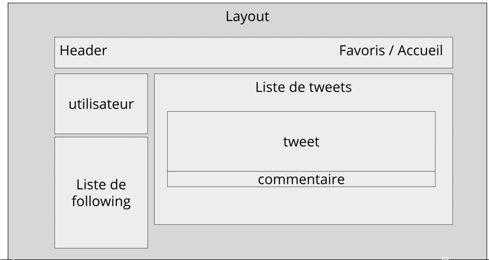

# Projet Twitter

On va créer une application Twitter en utilisant Express.

## Les features de l'application

- [ ] Api relative aux users
  - [ ] Création d'un utilisateur
  - [ ] Un utilisateur peut modifier ses informations
  - [ ] Un utilisateur peut supprimer son compte
  - [ ] Un utilisateur peut voir ses informations
- [ ] Api relative aux tweets
  - [ ] Un utilisateur peut créer un tweet
  - [ ] Un utilisateur peut supprimer un tweet
  - [ ] Un utilisateur peut lire les tweets
  - [ ] Un utilisateur peut liker un tweet
  - [ ] Un utilisateur peut unlike un tweet
- [ ] Tweets feed
  - [ ] Un utilisateur peut voir le feed de tweets
- [ ] Système d'authentification
  - [ ] Un utilisateur peut se connecter
  - [ ] Un utilisateur peut se déconnecter
- [ ] Follow de users
  - [ ] Un utilisateur peut suivre un autre utilisateur
  - [ ] Un utilisateur peut unfollow un autre utilisateur
- [ ] Commentaires sur les tweets
  - [ ] Un utilisateur peut commenter un tweet
  - [ ] Un utilisateur peut lire les commentaires d'un tweet
  - [ ] Un utilisateur peut modifier un commentaire
  - [ ] Un utilisateur peut supprimer un commentaire
- [ ] Ajout de socket.io pour temps reel
  - [ ] update le Tweet feed
  - [ ] update les followers feed
  - [ ] update les notifications

## 1. Setup de l'application

- [ ] Mise en place de l'architecture Express
- [ ] Création du layout et de la topbar
