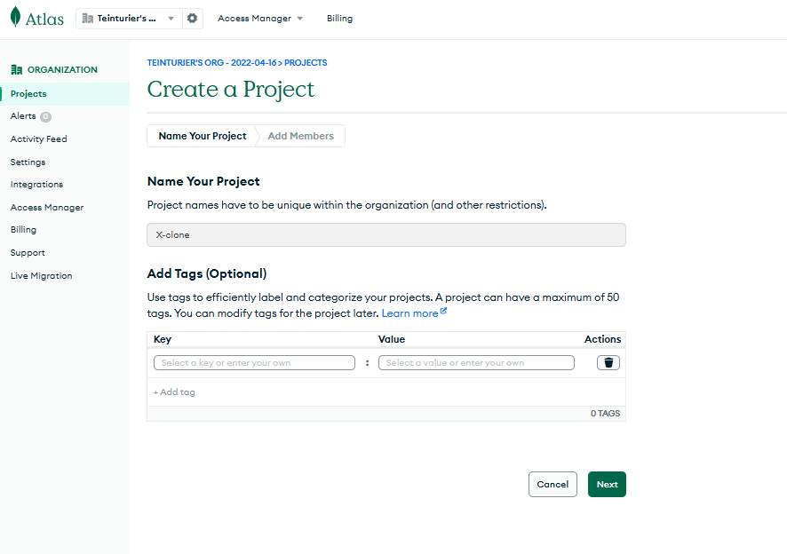
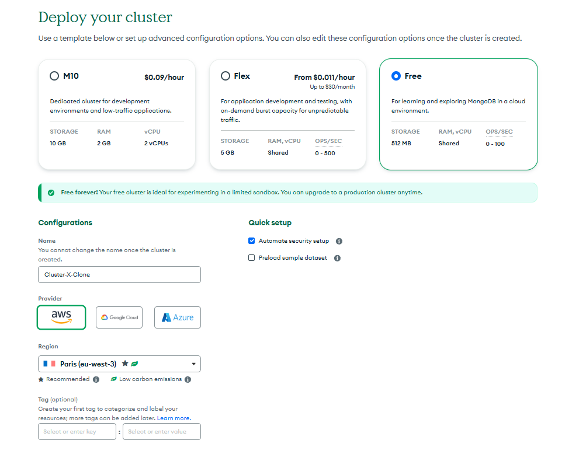
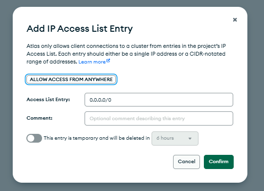
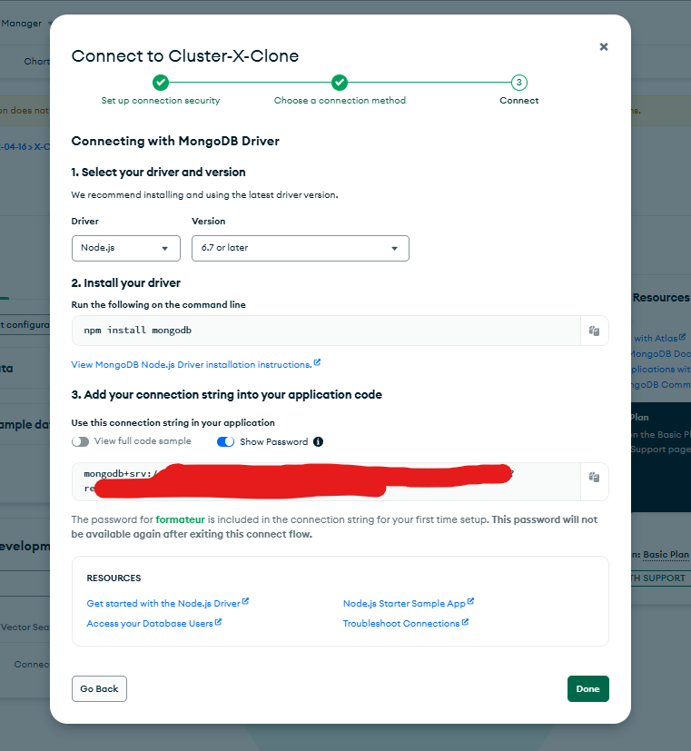
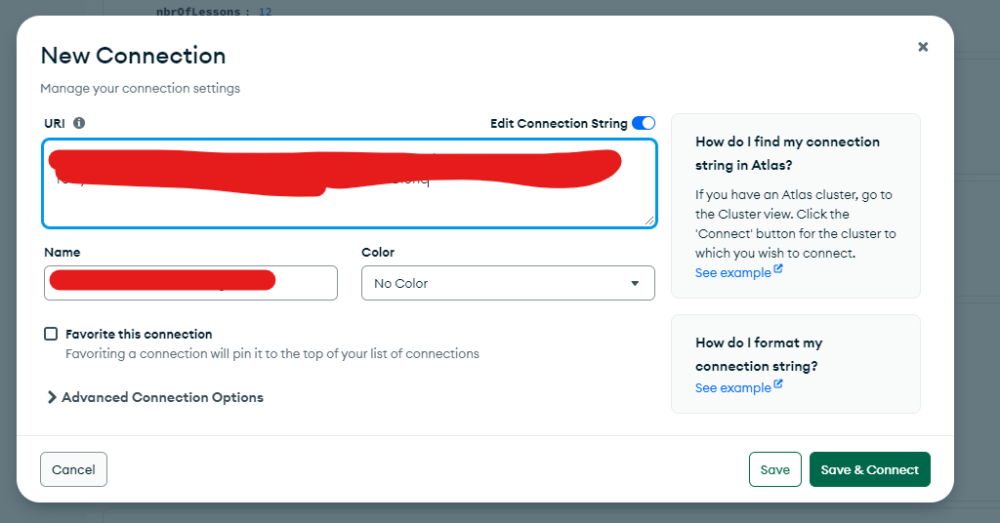

# Gestion des Tweets avec Node.js, Express et MongoDB Atlas

## Mise à jour des views pour les tweets

### 1. Création des views pour les tweets

Nous allons créer des views spécifiques pour les tweets.  
Ajout d’un répertoire `tweets` dans le dossier `views`.

Dans ce répertoire, créez deux fichiers `ejs` :

- **`tweet-list.ejs`** : Affiche la liste des tweets. Elle remplace la section `home`.
- **`tweet-form.ejs`** : Contient le formulaire de création de tweet.

#### **Contenu de `tweet-list.ejs`**

<!--  -->

Nous ajoutons un conteneur global avec une section gauche et une section centrale. Dans la section gauche on va inclure le fichier profile.ejs.
Nous avons mis quelques classes css pour avoir un visuel cohérent.

```html
<div class="container">
  <!-- Section gauche : Profil -->
  <aside class="profile-section"><%- include("../includes/profile") %></aside>

  <!-- Section centrale : Liste des tweets -->
  <main class="tweet-list">
    <h1>Derniers posts</h1>
    <ul>
      <!-- Exemple de tweets pour structure -->
      <li class="tweet-item">
        <h2>Nom auteur</h2>
        <p>Contenu du post ...</p>
      </li>
      <li class="tweet-item">
        <h2>Nom auteur</h2>
        <p>Contenu du post ...</p>
      </li>
      <li class="tweet-item">
        <h2>Nom auteur</h2>
        <p>Contenu du post ...</p>
      </li>
    </ul>
  </main>
</div>
```

#### **CSS associé**

```css
/* Conteneur global */
.container {
  display: flex;
  gap: 20px;
  max-width: 1200px;
  margin: 0 auto;
  padding: 20px;
}

@media (max-width: 768px) {
  .container {
    flex-direction: column;
  }
}

/* Section centrale : Liste des tweets */
.tweet-list {
  flex: 1;
  background-color: #fff;
  padding: 15px;
  border-radius: 8px;
  box-shadow: 0 2px 4px rgba(0, 0, 0, 0.1);
}

.tweet-list h1 {
  font-size: 24px;
  margin-bottom: 15px;
}

.tweet-item {
  margin-bottom: 20px;
  padding-bottom: 10px;
  border-bottom: 1px solid #e0e0e0;
}

.tweet-item:last-child {
  border-bottom: none;
}

.tweet-item h2 {
  font-size: 18px;
  font-weight: bold;
  margin-bottom: 5px;
}

.tweet-item p {
  font-size: 16px;
  color: #444;
}
```

### 2. Création de la view pour le profil

Ajout du fichier **`includes/profile.ejs`** pour afficher des informations sur l'utilisateur.

Sur ce profil on retrouvera par la suite le profil et d'autres composants.
Pour le moment on va juste metre quelques éléments et un peu de css pour le style globale de l'application.

#### **Contenu de `includes/profile.ejs`**

```html
<section class="profile">
  <h2>Profil utilisateur</h2>
  <p>Placeholder for profile details.</p>
</section>
```

#### **CSS associé**

```css
/* Section gauche : Profil */
.profile-section {
  flex: 0 0 30%;
  width: 100%; /* Par défaut, occupe toute la largeur disponible */
  max-width: 300px; /* Limite de largeur sur grands écrans */
  background-color: #f9f9f9;
  padding: 15px;
  border-radius: 8px;
  box-shadow: 0 2px 4px rgba(0, 0, 0, 0.1);
  box-sizing: border-box; /* Inclut le padding dans la largeur totale */
}

.profile-section h2 {
  font-size: 18px;
  margin-bottom: 10px;
}

.profile-section p {
  font-size: 16px;
  color: #555;
}

@media (max-width: 768px) {
  .profile-section {
    flex: none; /* Annule les règles Flex */
    width: 100%; /* Prend toute la largeur disponible */
    max-width: none; /* Désactive la limite de largeur */
    margin-bottom: 20px; /* Ajoute un espacement sous l'élément */
  }
}

@media (max-width: 370px) {
  .profile-section {
    padding: 10px; /* Réduit légèrement le padding pour les très petits écrans */
    font-size: 14px; /* Réduit la taille globale des polices */
    width: 100%; /* Prend toujours toute la largeur */
    margin: 0 auto 20px auto; /* Garde un centrage visuel */
  }
}
```

### 3. Mise à jour de la route pour la page d'accueil

Modification de la route pour afficher la liste des tweets sur la page d'accueil.

#### **Code dans `/routes/index.js`**

```js
router.get("/", (req, res) => {
  res.render("layout", { content: "tweets/tweet-list" });
});
```

## Creation page formulaire d'ajout de tweet

### 1. Ajout du lien vers le formulaire

Ajout du lien vers la création de tweet dans le bouton "Poster" de la topbar :

```html
<a href="/tweet/new" class="topbar__button-link">
  <button class="topbar__button">Poster</button>
</a>
```

### 2. Création de la route pour le formulaire

Ajout d’une route pour afficher le formulaire de création de tweet. Pour le moment on va mettre toutes les routes dans le fichier index.js mais par la suite on refactorisera pour que notre fichier index.js serve de dispatcher vers les bonnes routes.
On ajoute une variable errors dans la route pour la page de création de tweet car nous en aurons besoin pour la gestion des erreurs dans le formulaire.

#### **Code dans `/routes/index.js`**

```js
router.get("/tweet/new", (req, res) => {
  res.render("layout", { content: "tweets/tweet-form", errors: undefined });
});
```

### 3. Création de la view pour le formulaire

Enfin on créer le fichier tweet-form.ejs dans le repertoire tweets :

#### **Contenu de `tweet-form.ejs`**

```html
<section class="tweet-form-section">
  <h1>Ecrire un tweet</h1>
  <form action="/api/tweets" method="POST">
    <label for="content">Contenu</label>
    <textarea id="content" name="content" rows="3" required></textarea>
    <button type="submit">Poster</button>
  </form>
</section>
```

#### **CSS associé**

```css
/* Formulaire pour ajouter un tweet */
.tweet-form-section {
  max-width: 600px; /* Largeur maximale sur les grands écrans */
  width: 90%; /* Ajuste la largeur pour petits écrans */
  margin: 20px auto; /* Centre le formulaire horizontalement */
  padding: 20px; /* Ajoute des espaces internes */
  background-color: #fff;
  border-radius: 8px;
  box-shadow: 0 2px 4px rgba(0, 0, 0, 0.1);
  box-sizing: border-box; /* Garantit une largeur cohérente */
}

.tweet-form-section h1 {
  margin-bottom: 20px;
  font-size: 24px;
}

form label {
  display: block;
  margin-bottom: 5px;
  font-weight: bold;
}

form input,
form textarea {
  width: 100%; /* Utilise toute la largeur du conteneur */
  max-width: 580px; /* Largeur maximale pour les grands écrans */
  padding: 10px;
  margin-bottom: 15px;
  border: 1px solid #ccc;
  border-radius: 4px;
  font-size: 14px;
  box-sizing: border-box; /* Inclut padding et bordures dans le calcul de la largeur */
}

form button {
  background-color: #1da1f2;
  color: white;
  border: none;
  padding: 10px 20px;
  border-radius: 4px;
  cursor: pointer;
  transition: background-color 0.3s;
}

form button:hover {
  background-color: #0d8bdb;
}

@media (max-width: 768px) {
  .tweet-form-section {
    width: 95%; /* Utilise presque toute la largeur de l'écran sur tablette */
    padding: 15px; /* Réduit le padding pour conserver de l'espace */
  }

  form input,
  form textarea {
    max-width: 100%; /* Les champs s'adaptent à la largeur disponible */
  }
}

@media (max-width: 480px) {
  .tweet-form-section {
    width: 100%; /* Utilise toute la largeur sur mobile */
    padding: 10px; /* Réduit le padding pour les très petits écrans */
  }

  form input,
  form textarea {
    width: 100%; /* S'étend sur toute la largeur */
    font-size: 12px; /* Réduit légèrement la taille de la police pour un meilleur rendu */
  }

  form button {
    width: 100%; /* Bouton pleine largeur */
    font-size: 14px;
  }
}
```

Le logo dans la topbar est un lien qui ramène à la page d'accueil. (list des tweets) et le bouton Poster est un lien qui ramène à la page de création de tweet.

## Mise en place base de donnée et de Mongoose

### 1. Création d'une base de donnée sur Atlas

Accédez à MongoDB Atlas :  
[Atlas](https://www.mongodb.com/fr-fr/cloud/atlas/register)

#### Étapes :

1. **Créer un nouveau projet :**  
   

2. **Créer un cluster :**  
   

3. **Configurer les autorisations d'accès :**

   - Ajoutez un nom d'utilisateur et un mot de passe pour la connexion au cluster.
   - L'IP de votre ordinateur sera automatiquement ajoutée dans la liste des IP autorisées.
   - Si vous n'avez pas d'IP fixe, autorisez l'accès depuis n'importe quelle IP :
     - Accédez à "Network Access" dans Atlas.
     - Cliquez sur "Add IP Address" et sélectionnez "Allow access from anywhere".  
       Cela ajoutera `0.0.0.0/0` comme IP autorisée.  
       **⚠ Attention :** Ce n'est pas une bonne pratique de laisser cet accès en permanence.

   

4. **Choisir la méthode de connexion :**
   - Dans Atlas, choisissez "Connect" et sélectionnez la connexion via les drivers Node.js.
     
   - Ajoutez l'URI de connexion dans le fichier `.env` :
   ```bash
   ATLAS_URI="mongodb+srv://<username>:<password>@<cluster>.mongodb.net/?retryWrites=true&w=majority"
   ```
5. **Vérification avec Compass :**  
   Vous pouvez utiliser MongoDB Compass pour visualiser vos données :  
   

### 2. Installation de Mongoose

Pour utiliser MongoDB avec Node.js, installez Mongoose :

```bash
npm install mongoose
```

### 3. Configuration de la connexion à la base de données

1. **Ajout de l'URI dans `.env` :**

```bash
ATLAS_URI="mongodb+srv://<username>:<password>@<cluster>.mongodb.net/?retryWrites=true&w=majority"
```

2. **Création du fichier `/database/index.js` :**

```js
const mongoose = require("mongoose");

mongoose
  .connect(process.env.ATLAS_URI)
  .then(() => {
    console.log("Connexion base de donnée ok");
  })
  .catch((err) => {
    console.log("Erreur de connexion à la base de donnée :", err);
  });
```

3. **Chargement de la connexion dans `/app.js` :**

```js
require("dotenv").config(); // Charger les variables d'environnement au début pour windows

const express = require("express");
const morgan = require("morgan");
const path = require("path");
const index = require("./routes/index");
require("./database");

const app = express();
const port = process.env.PORT || 3000;

// configuration du moteur de template
app.set("views", path.join(__dirname, "views"));
app.set("view engine", "ejs");

// configuration des fichiers statiques
app.use(express.static(path.join(__dirname, "public")));

// configuration des middlewares globaux
app.use(morgan("short"));
app.use(express.json());
app.use(express.urlencoded({ extended: true }));

// définitions de nos routes
app.use(index);

app.listen(port, () => {
  console.log(`Server is running on http://localhost:${port}`);
});
```

### 4. Création du model tweet

Pour le moment un model très simple avec juste un contenu.

**Fichier : `/database/models/tweet.model.js`**

```js
const mongoose = require("mongoose");
const schema = mongoose.Schema;

const tweetSchema = schema({
  content: {
    type: String,
    maxlength: [140, "Tweet trop long"],
    minlength: [1, "Tweet trop court"],
    required: [true, "Tweet manquant"],
  },
  createdAt: {
    type: Date,
    default: Date.now,
  },
  modifiedAt: {
    type: Date,
    default: Date.now,
  },
});

const Tweet = mongoose.model("Tweet", tweetSchema);

module.exports = Tweet;
```

## Création de l'api pour les tweets

### 1. Création de la route pour la création de tweet

1. **Ajout du sous-routeur `api` dans `/routes/index.js` :**

```js
const router = require("express").Router();
const apiRouter = require("./api");

router.use("/api", apiRouter);
// reste du code
```

2. **Création du sous-routeur API : `/routes/api.js`**

```js
const router = require("express").Router();
const tweetsRouter = require("./api/tweets");

router.use("/tweets", tweetsRouter);

module.exports = router;
```

3. **Route POST pour ajouter un tweet : `/routes/api/tweets.js`**

Nous allons utiliser la méthode POST pour l'ajout de tweet.
Et nous utilisons notre model Tweet pour créer un nouveau tweet.
Enfin nous executons la méthode save() pour sauvegarder le tweet dans la base de donnée.
Si tout se passe bien nous redirigeons vers la page d'accueil.
Si il y a des erreurs, nous les récupérons, mettons les messages d'erreurs dans un tableau et les envoyons à la vue pour afficher les erreurs dans le formulaire.

/routes/api/tweets.js

```js
const router = require("express").Router();
const Tweet = require("../../database/models/tweet.model");

router.post("/", (req, res) => {
  const body = req.body;
  const newTweet = new Tweet(body);

  newTweet
    .save()
    .then((tweet) => {
      res.redirect("/");
    })
    .catch((err) => {
      const errors = Object.keys(err.errors).map(
        (key) => err.errors[key].message
      );
      res
        .status(400)
        .render("layout", { content: "tweets/tweet-form", errors: errors });
    });
});

module.exports = router;
```

### 2. Gestion des erreurs dans le formulaire

Nous allons afficher les erreurs dans le formulaire. Elles nous sont passées en paramètre dans la vue par le biais de la variable errors dans /routes/api/tweets.js.

#### Mise à jour de `/views/tweets/tweet-form.ejs` :

```html
<section class="tweet-form-section">
  <h1>Ecrire un tweet</h1>
  <form action="/api/tweets" method="POST">
    <label for="content">Contenu</label>
    <textarea id="content" name="content" rows="3" required></textarea>
    <% if (errors !== undefined && errors.length > 0) { %>
    <div class="error-message" id="contentError">
      <% errors.forEach(function (error) { %>
      <p class="error-text"><%= error %></p>
      <% }) %>
    </div>
    <% } %>
    <button type="submit">Poster</button>
  </form>
</section>
```

#### CSS pour les erreurs :

```css
/* Gestion des erreurs */
.error-message {
  background-color: #ffe6e6; /* Rouge pâle pour signaler une erreur */
  color: #d9534f; /* Rouge foncé pour le texte */
  border: 1px solid #d9534f; /* Bordure pour démarquer la zone */
  border-radius: 4px; /* Coins arrondis */
  padding: 10px; /* Espacement interne pour une meilleure lisibilité */
  margin-bottom: 15px; /* Espace sous le message d'erreur */
  font-size: 14px; /* Taille de police pour correspondre au style du formulaire */
}

.error-text {
  margin: 0; /* Supprime les marges par défaut */
  padding: 5px 0; /* Espacement vertical entre chaque erreur */
}
```

## Affichage de la liste des tweets

Mise à jour de la route pour la page d'accueil avec la récupération des tweets et l'envois de ces tweets à la vue.

/routes/index.js

```js
const Tweet = require("../models/tweet");

router.get("/", (req, res) => {
  Tweet.find({})
    .sort({ createdAt: -1 })
    .then((tweets) => {
      res.render("layout", { content: "tweets/tweet-list", tweets: tweets });
    });
});
```
